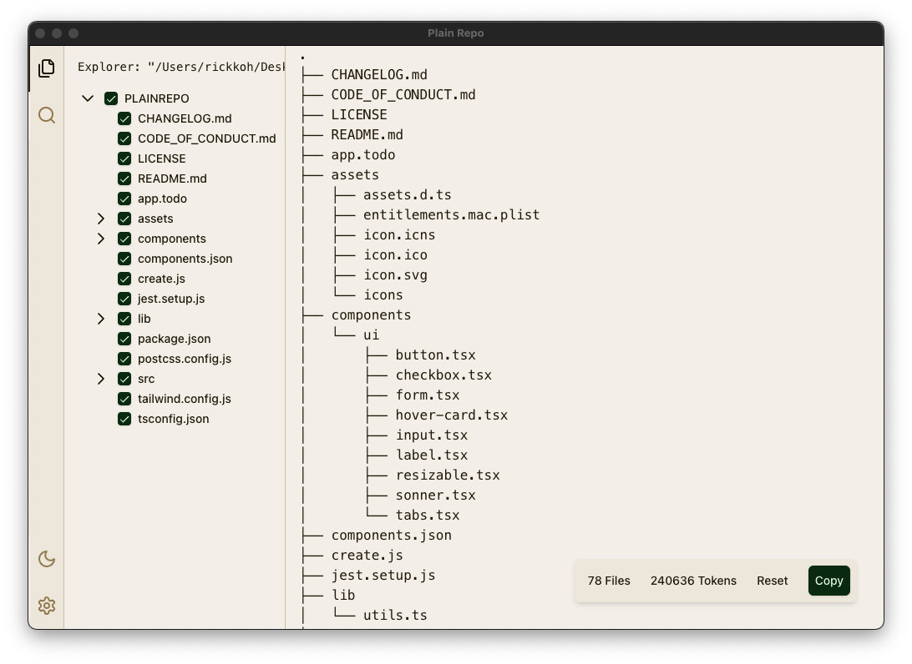

<p align="center">
  
</p>

# Plainrepo

Plainrepo is a desktop application that helps developers **select**, **view**, and **copy** the plain-text contents of any subset of files in a repository. It’s perfect for feeding **precise context** to large language models (LLMs), debugging, refactoring, and general code analysis.

<p align="center">
  
</p>

## Features

- **Selective File Inclusion** – Choose individual files or entire folders.
- **Plain Text Export** – Generate a single text file with all selected code.
- **Search & Filter** – Quickly find relevant files, text, or patterns.
- **Replace Sensitive Info** – Easily sanitize code before sharing.
- **Multiple Tabs** – Keep different sets of files or contexts organized.
- **One-Click Copy** – Send your curated code context to any AI tool.

## Getting Started

1. **Clone the Repository**

   ```bash
   git clone https://github.com/your-username/plainrepo.git
   cd plainrepo
   ```

2. **Install Dependencies**

   ```bash
   npm install
   ```

3. **Start the App (Development Mode)**

   ```bash
   npm run start
   ```

   This runs both the Electron main and React renderer in development mode.

4. **Build for Production**
   ```bash
   npm run package
   ```
   This packages the app for distribution on your current operating system.

## Contributing

We welcome contributions to Plainrepo! Please see our [Code of Conduct](./CODE_OF_CONDUCT.md) for guidelines on how to participate respectfully in our community.

## Maintainers

- [Rick Koh](https://github.com/rickkoh)

## License

This project is licensed under the [MIT License](./LICENSE).

## Acknowledgments

- Based on [Electron React Boilerplate](https://github.com/electron-react-boilerplate/electron-react-boilerplate).
- Created & Maintained by [Rick Koh](mailto:rick.kohjiaxuan@gmail.com).
